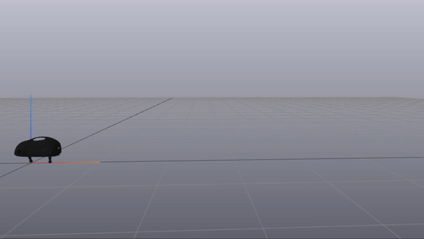
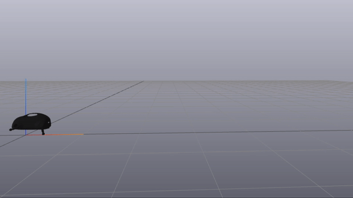

# Optimization-based Motion Planning Methods for Legged Robots

## William Chen and Alex Cuellar

This is our code for the final project of 6.832 - Underactuated Robotics, taught by Dr. Russ Tedrake 
at MIT in the spring 2021 semester. The code is in an ipynb which is meant to be used on Google Colab.
This code modifies the notebooks presented in the [class's online textbook](http://underactuated.csail.mit.edu/Spring2021/). 

|Walking Gait|Running Gait|
|:--------:|:------------:|
|||

We looked at two different numerical optimization methods for motion planning with legged robots. The first method uses a non-linear program solver in conjunction with a hard-coded mode sequence (i.e. when each of the robots' feet are in contact with the ground). The second method is detailed in [\[Valenzuela, 2016\]](https://groups.csail.mit.edu/robotics-center/public_papers/Valenzuela16.pdf), instead using a mixed-integer quadratic program (MIQP) in conjunction with linear convex approximations of non-linear decision variable constraints to describe robot dynamics and kinematics.

We implemented the former on a simulated planar version of Boston Dynamics' LittleDog robot. This was done in Python, using PyDrake's simulation capabilities as well as its built-in mathematical program solvers.

